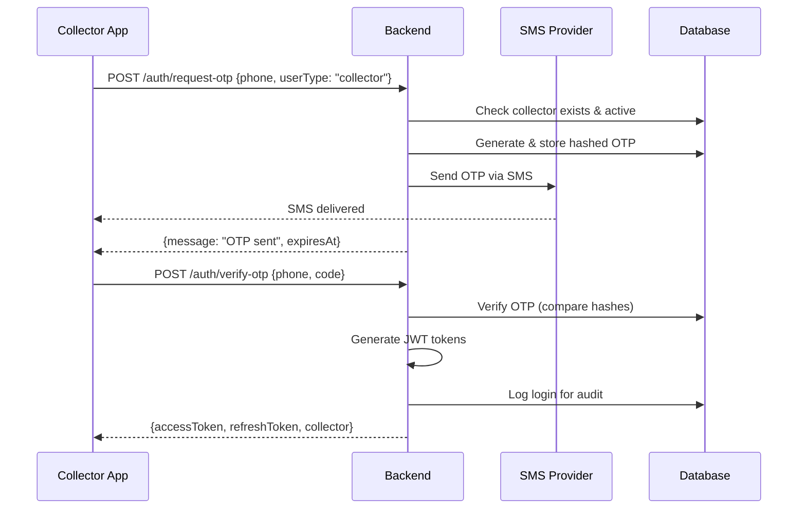
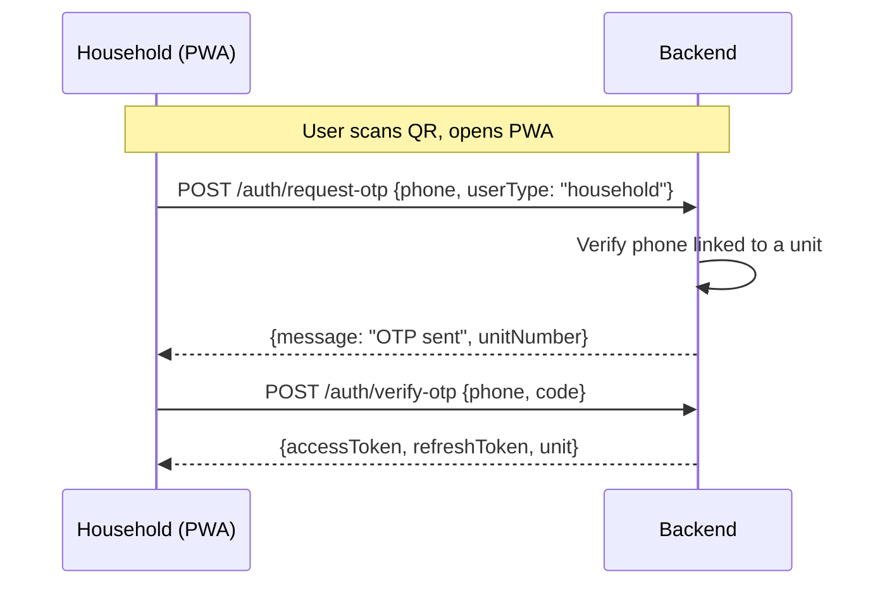

# Smart Bin - Authentication Layer

## Overview

The authentication layer handles all user authentication and authorization for the Smart Bin system. It supports:

- **OTP-based authentication** (primary method for mobile/PWA users)
- **Password-based authentication** (optional for dashboard users)
- **JWT token management** (access + refresh tokens)
- **Role-based access control** (RBAC)

## Authentication Flows

### 1. Collector Login Flow



### 2. Household Login Flow



### 3. Dashboard User Login

Dashboard users (Admin, Supervisor, Contractor, Govt) can use:
- OTP-based login (same as above with `userType: "dashboard"`)
- Password-based login (for admin convenience)

## JWT Token Structure

### What is JWT?

JWT (JSON Web Token) is a secure way to transmit user identity between client and server.

**Structure**: `xxxxx.yyyyy.zzzzz`
- **Header**: Token type and algorithm
- **Payload**: User data (claims)
- **Signature**: Verification hash

### Token Payload

```typescript
interface JWTPayload {
  sub: string;        // User ID
  role: UserRole;     // ADMIN, COLLECTOR, etc.
  phone: string;      // Phone number
  type: 'access' | 'refresh';
  iat: number;        // Issued at (timestamp)
  exp: number;        // Expiration (timestamp)
}
```

### Token Lifetimes

| Token Type | Lifetime | Purpose |
|------------|----------|---------|
| Access Token | 7 days | API authentication |
| Refresh Token | 30 days | Get new access token |

### Why Two Tokens?

1. **Access Token**: Short-lived, sent with every request
2. **Refresh Token**: Longer-lived, used only to get new access tokens

This pattern limits exposure if an access token is compromised.

## OTP Security

### OTP Generation

```typescript
// Generate 6-digit OTP
const otp = generateOTP(6); // e.g., "847293"

// Hash before storing (never store plain OTP!)
const hashedOTP = await bcrypt.hash(otp, 12);
```

### OTP Verification

```typescript
// Compare provided OTP with stored hash
const isValid = await bcrypt.compare(userCode, storedHash);
```

### Security Measures

| Measure | Implementation |
|---------|----------------|
| Rate Limiting | Max 1 OTP per 60 seconds |
| Max Attempts | 3 attempts before invalidation |
| Expiration | 5 minutes |
| Hashing | bcrypt with 12 rounds |

## Role-Based Access Control (RBAC)

### Role Hierarchy

```
ADMIN (100)         - Full system access
  ↓
SUPERVISOR (80)     - Ward-level control
  ↓
CONTRACTOR (60)     - Operations oversight
  ↓
GOVT (40)           - View only (no payment data)

COLLECTOR (30)      - Mobile app (assigned units only)
HOUSEHOLD (20)      - PWA (own unit only)
```

### Permission Matrix

| Role | Collections | Payments | Complaints | Users | QR Mgmt |
|------|-------------|----------|------------|-------|---------|
| ADMIN | ✅ Full | ✅ Full | ✅ Full | ✅ Full | ✅ Full |
| SUPERVISOR | ✅ Ward | ✅ Ward | ✅ Ward | ❌ | ❌ |
| CONTRACTOR | ✅ View | ✅ View | ✅ View | ❌ | ❌ |
| GOVT | ✅ View | ❌ | ✅ View | ❌ | ❌ |
| COLLECTOR | ✅ Own | ✅ Own | ✅ Own | ❌ | ❌ |
| HOUSEHOLD | ✅ Own | ✅ Own | ✅ Own | ❌ | ❌ |

## Security Best Practices

### Password Hashing

We use **bcrypt** for password hashing:

```typescript
// Hash password
const hash = await bcrypt.hash(password, 12);

// Verify password
const isValid = await bcrypt.compare(input, hash);
```

**Why bcrypt?**
- Designed to be slow (resists brute-force)
- Automatic salt generation
- Resistant to rainbow table attacks

### Token Security

1. **Never expose JWT secret** - Keep in environment variables
2. **Use HTTPS** - Tokens are sent in headers
3. **Validate on every request** - Check signature and expiration
4. **Include minimal data** - Only necessary claims in payload

### API Security Headers

```typescript
// Required header for protected routes
Authorization: Bearer <access_token>
```

## Implementation Files

| File | Purpose |
|------|---------|
| `src/lib/auth/jwt.ts` | JWT generation and verification |
| `src/lib/auth/otp.ts` | OTP generation, storage, verification |
| `src/lib/security/index.ts` | Hashing, encryption utilities |
| `src/middleware/auth.middleware.ts` | Request authentication |
| `src/services/auth.service.ts` | Authentication business logic |
| `src/app/api/auth/` | API endpoints |

## API Reference

### Request OTP

```http
POST /api/auth/request-otp
Content-Type: application/json

{
  "phone": "+919876543210",
  "userType": "collector" | "household" | "dashboard"
}
```

**Response (200 OK):**
```json
{
  "success": true,
  "data": {
    "message": "OTP sent successfully",
    "expiresAt": "2026-01-20T12:05:00Z"
  }
}
```

### Verify OTP

```http
POST /api/auth/verify-otp
Content-Type: application/json

{
  "phone": "+919876543210",
  "code": "123456",
  "userType": "collector"
}
```

**Response (200 OK):**
```json
{
  "success": true,
  "data": {
    "accessToken": "eyJhbGciOiJIUzI1NiIs...",
    "refreshToken": "eyJhbGciOiJIUzI1NiIs...",
    "collector": {
      "id": 1,
      "name": "Ravi Kumar",
      "phone": "+919876543210",
      "assignedRoute": "Ward 5"
    }
  }
}
```

### Refresh Token

```http
POST /api/auth/refresh
Content-Type: application/json

{
  "refreshToken": "eyJhbGciOiJIUzI1NiIs..."
}
```

**Response (200 OK):**
```json
{
  "success": true,
  "data": {
    "accessToken": "eyJhbGciOiJIUzI1NiIs...",
    "refreshToken": "eyJhbGciOiJIUzI1NiIs..."
  }
}
```

## Error Codes

| Code | Description |
|------|-------------|
| `NO_TOKEN` | Authorization header missing |
| `INVALID_TOKEN` | Token signature invalid |
| `TOKEN_EXPIRED` | Token has expired |
| `OTP_ERROR` | OTP verification failed |
| `RATE_LIMITED` | Too many OTP requests |
| `UNAUTHORIZED` | Authentication required |
| `FORBIDDEN` | Insufficient permissions |
